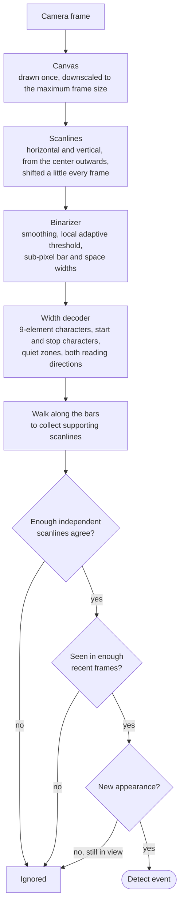
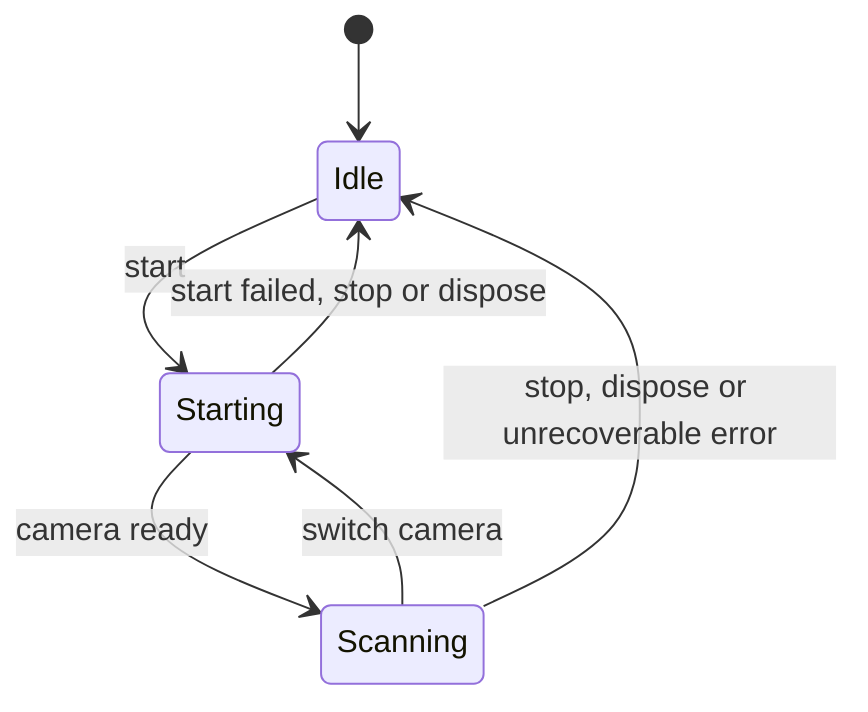
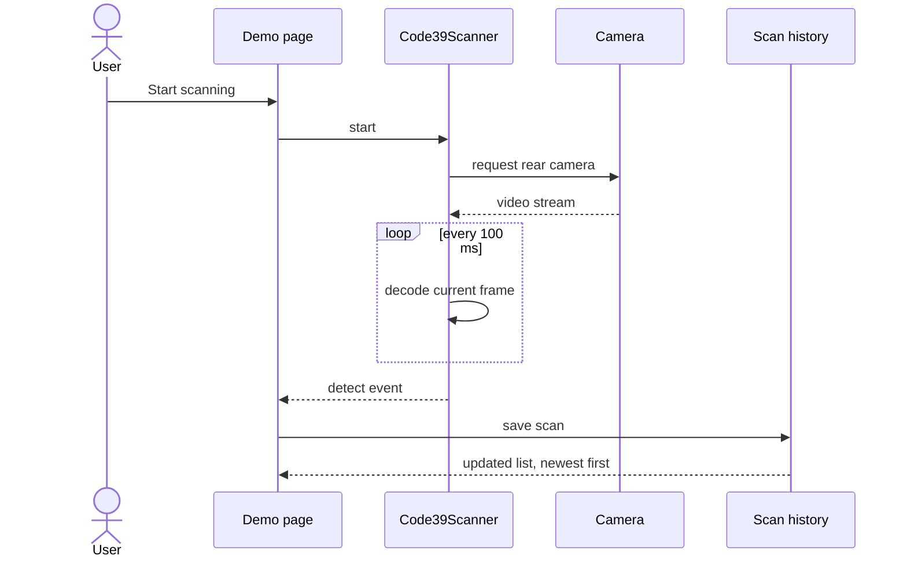
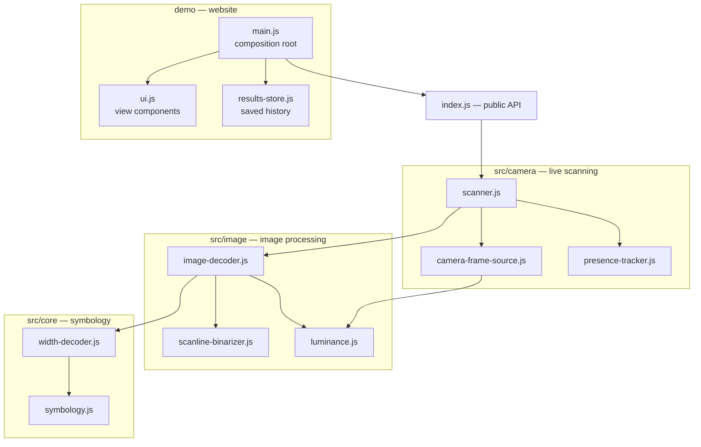

# Code 39 Scanner

A zero-dependency Code 39 barcode scanner for the browser, written in plain JavaScript. It opens
the device camera, reads Code 39 barcodes in real time and lists the scanned values below the
camera preview. Everything runs on the device: no server, no third-party library, no data leaves
the browser.

**Live demo:** [code39scanner.vercel.app](https://code39scanner.vercel.app/)  
**Repository:** [github.com/yagnikpipaliya/code39scanner](https://github.com/yagnikpipaliya/code39scanner)

## At a glance

| Item                 | Details                                                                  |
| -------------------- | ------------------------------------------------------------------------ |
| Runtime dependencies | None. Image processing, decoding and camera handling are all in-house.   |
| Language             | Plain JavaScript (ES2022 modules), documented with JSDoc; no build step  |
| Symbology            | Code 39 (43 characters) and optional Full ASCII (all 128 characters)     |
| Inputs               | Live camera stream, or any still image (RGBA or grayscale)               |
| Hosting              | Static site on Vercel; the library is packaged as an npm-ready module    |
| Dev dependencies     | None. No build tools, no install step.                                   |

## Features

- **Robust decoding.** Local adaptive thresholding handles uneven lighting and shadows. Sub-pixel
  edge detection handles low resolution and blur. Wide tolerances absorb print gain, perspective
  and tilt. Barcodes are read in either orientation, upside down, and several per frame.
- **Confirmed reads.** A value is reported only after several independent scanlines agree on it,
  so one-off misreads caused by noise or printed text are never reported.
- **Once per appearance.** A barcode that stays in view is reported once. It is reported again
  only after it has been out of view for a configurable time.
- **Efficient.** Each camera frame is drawn once, and only the sampled scanlines are read back
  from the canvas. The scanlines shift every frame, so over a few frames they sweep the whole
  image.
- **Safe lifecycle.** The rear camera is preferred and cameras can be switched. Start and stop
  calls are serialized and cancellable, so double clicks cannot leave the camera on. Scanning
  pauses in background tabs and shuts down on unrecoverable errors.
- **Typed errors.** Every error has a stable, machine-readable code.

## How it works

Each camera frame goes through the decoding pipeline below.

**Confirmation.** A value must be decoded by a minimum number of scanlines that are at least
three narrow-bar widths apart. Lines that close together still fit on a tilted barcode, but
they are far enough apart that a pattern appearing on a single pixel row is not confirmed by its
own neighbours. When one scanline decodes a value, the decoder walks along the bars in both
directions until the value stops decoding, so even a barcode crossed by only one sampled line
can be confirmed. Labels with the same text but clearly different sizes are confirmed
separately.

**Frame confirmation.** Optionally, a value must also appear in a number of the last 10 frames
before it is reported. Misses in between do not reset the count, so small barcodes that the
moving scanlines cross only now and then still confirm.

**Presence tracking.** Once reported, a barcode is remembered while it stays in view. It is
reported again only after it has been absent for longer than the presence timeout. Timing uses
a monotonic clock, so changes to the system time cannot cause duplicate or missed reports.

## Scanner lifecycle

**Failure policy.**

- A frame that fails for an unexpected reason is reported as an error, and scanning continues.
- Empty frames, for example while the camera warms up, are skipped silently.
- Scanning stops automatically in two cases, and the failure is reported once:
  - the error cannot be fixed by retrying: an unsupported browser, a camera that is missing,
    busy or unplugged, or invalid frames
  - five processed frames in a row fail

When an error is reported, the scanner state tells the two cases apart: still scanning means the
error was recoverable, idle means scanning has stopped.

## The demo website

- **Start and stop** with a single button, which also cancels a start that is still waiting for
  camera permission. The camera is released when the page is closed or hidden.
- **Camera picker.** It lists the available cameras once permission has been granted.
- **Live feedback.** A "Live" badge, a scan guide with a moving laser line, and a green flash
  when a barcode is detected.
- **Results list.** The newest scans appear first, each with its time and a copy button, plus a
  "Clear all" action.
- **Saved history.** Up to 500 scans are kept in the browser's local storage and stay in sync
  across open tabs. A clear in one tab clears every tab.
- **Friendly errors.** There are clear messages for denied permission, insecure (non-HTTPS)
  pages, unsupported browsers and busy cameras.
- **Light and dark themes.** The page follows the system setting.

## Project structure

| Location         | Contents                                                                             |
| ---------------- | ------------------------------------------------------------------------------------ |
| src/core         | Code 39 character patterns, Full ASCII expansion and the bar-width decoder           |
| src/image        | Luminance sources, the scanline binarizer and the whole-image decoder                |
| src/camera       | The camera frame source, the presence tracker and the live scanner                   |
| src (root files) | Shared types, options and validation, typed errors, the event emitter, small helpers |
| index.html       | The demo page markup                                                                 |
| demo             | The website: styles, composition root, view components and scan history              |

**Imports.** Modules use relative imports, so the same files run unchanged in the browser and in
Node.js, and editors can follow them with Ctrl+Click without any configuration. The demo imports
the library only through its public entry point, src/index.js, exactly as an npm consumer would.

**Design principles.** Each module has one responsibility. The scanner depends on a frame
source abstraction rather than on the camera directly, so other inputs, such as a video file or a
set of still images, can supply frames. There is one source of truth for character patterns,
option defaults and valid ranges. Invalid input is rejected at the public boundary with a typed
error.

## Configuration

All options are optional and are validated when the scanner is created. The only other
requirement is a video element for the preview, or a custom frame source instead.

| Option                | Default | Meaning                                                                         |
| --------------------- | ------- | ------------------------------------------------------------------------------- |
| fullAscii             | off     | Expand Full ASCII shift pairs, for example +A becomes a lowercase a             |
| minLength             | 1       | Minimum number of data characters                                               |
| minQuietZone          | 5       | Blank margin required on each side, in narrow-bar widths (the spec requires 10) |
| scanLines             | 24      | Primary scanlines sampled per direction per frame                               |
| orientations          | both    | Scan horizontally, vertically, or both                                          |
| minConfirmations      | 2       | Independent scanlines that must agree on a value (1 to 10)                      |
| minFrameConfirmations | 1       | Frames, out of the last 10, that must contain the value (1 to 10)               |
| scanIntervalMs        | 100     | Minimum time between two decoded frames, in milliseconds                        |
| presenceTimeoutMs     | 1500    | Time a barcode must be out of view before it is reported again                  |
| maxFrameSize          | 1920    | Longest side of a frame after downscaling, in pixels                            |

## Events

| Event       | When it fires                                         | Payload                                                |
| ----------- | ----------------------------------------------------- | ------------------------------------------------------ |
| detect      | A confirmed barcode comes into view                   | Decoded text, raw text, format and detection timestamp |
| error       | Something fails while scanning                        | A typed error with a stable code                       |
| statechange | The scanner moves between idle, starting and scanning | The new state                                          |

## Errors

| Code                    | Raised when                                                  |
| ----------------------- | ------------------------------------------------------------ |
| INVALID_OPTIONS         | The scanner or decoder receives invalid options              |
| INVALID_ARGUMENT        | A method receives invalid input, such as a malformed image   |
| INSECURE_CONTEXT        | The page is not served over HTTPS or localhost               |
| UNSUPPORTED_BROWSER     | The camera API or Canvas 2D is unavailable                   |
| PERMISSION_DENIED       | The user or a browser policy denied camera access            |
| CAMERA_UNAVAILABLE      | No camera was found, the camera is busy, or the stream ended |
| OPERATION_CANCELLED     | A start was superseded by a later start, stop or dispose     |
| FRAME_PROCESSING_FAILED | A camera frame could not be processed                        |

## Requirements

- **Secure context.** The page must be served over HTTPS or from localhost; browsers only allow
  camera access there.
- **Browser.** Camera access and Canvas 2D, in Chrome or Edge 84+, Firefox 90+ or Safari 15+.

## Limitations

- Narrow bars must be at least about 2 pixels wide in the camera frame (about 1.5 pixels for
  longer barcodes). Below that, a barcode is not read at all rather than read partially. Move
  closer for small or dense barcodes.
- A scanline must cross the barcode from end to end, so the tilt it tolerates depends on the
  barcode's proportions. That is about 8 degrees for bars at the minimum height of 15% of the
  symbol length, and more for taller bars.
- Mod 43 check characters are not validated; they are returned as part of the data.
- Only Code 39 is supported.

## Development

The package is not published to npm yet. It can be installed straight from the GitHub
repository. There is nothing to compile or install: the source files are the package, and it
has no dependencies of any kind.

To run the demo locally, serve the repository folder with any static web server and open
index.html. Browsers do not load JavaScript modules from file:// pages, so a server is needed.
Some examples:

- `npx serve .`
- `python -m http.server 5173`
- the Live Server extension in VS Code

Mobile browsers block the camera on plain-HTTP network addresses, so to test on a phone during
development, serve the page over HTTPS, for example through a tunnel.

## Deployment

The demo is deployed on Vercel at [code39scanner.vercel.app](https://code39scanner.vercel.app/).
There is no build step: Vercel serves the repository as a static site, and .vercelignore limits
the deployment to the files the page loads (index.html, demo and src). Every page is served with
these security headers:

| Header                 | Value                                                          |
| ---------------------- | -------------------------------------------------------------- |
| Permissions-Policy     | Camera for this site only; microphone and geolocation disabled |
| X-Content-Type-Options | nosniff                                                        |
| X-Frame-Options        | DENY                                                           |
| Referrer-Policy        | strict-origin-when-cross-origin                                |

To deploy a copy, import the repository in Vercel as a new project and keep the detected
settings.

## License

MIT
