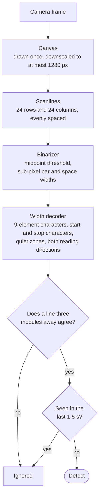
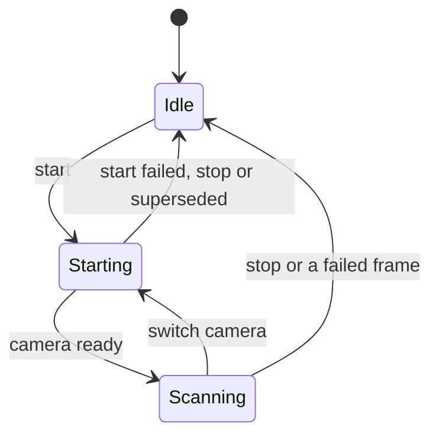
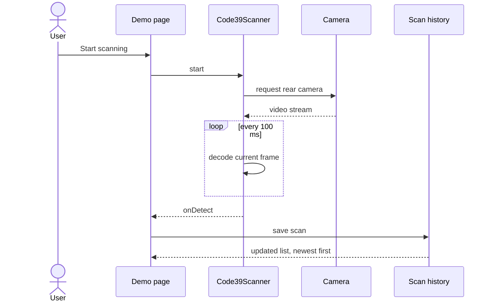
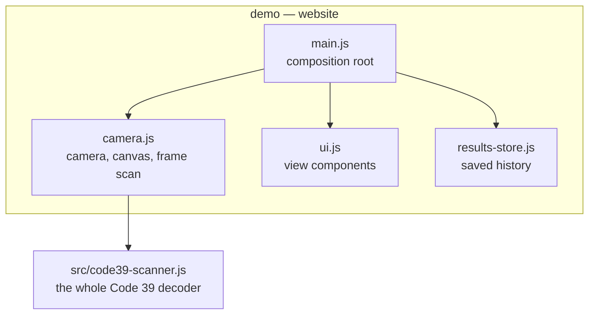

# Code 39 Scanner

A zero-dependency Code 39 barcode scanner for the browser, written in plain JavaScript. The
whole decoder is one file of under 100 lines. It opens the device camera, reads Code 39 barcodes
in real time and lists the scanned values below the camera preview. Everything runs on the
device: no server, no third-party library, no data leaves the browser.

**Live demo:** [code39scanner.vercel.app](https://code39scanner.vercel.app/)  
**Repository:** [github.com/yagnikpipaliya/code39scanner](https://github.com/yagnikpipaliya/code39scanner)

## At a glance

| Item                 | Details                                                                |
| -------------------- | ---------------------------------------------------------------------- |
| Decoder              | One file, `src/code39-scanner.js`, 95 lines, no imports                |
| Runtime dependencies | None. Image processing, decoding and camera handling are all in-house. |
| Language             | Plain JavaScript (ES2022 modules), documented with JSDoc; no build step |
| Symbology            | Code 39, all 43 characters                                             |
| Inputs               | Live camera stream, or any line of luminance samples                   |
| Hosting              | Static site on Vercel; the decoder is packaged as an npm-ready module  |
| Dev dependencies     | None. No build tools, no install step.                                 |

## Features

- **Robust decoding.** Sub-pixel edge detection handles low resolution and blur. Wide
  tolerances absorb print gain, perspective and tilt. Barcodes are read in either orientation,
  upside down, and several per frame.
- **Confirmed reads.** A value is reported only after a second scanline agrees on it, so one-off
  misreads caused by noise or printed text are never reported.
- **Once per appearance.** A barcode that stays in view is reported once. It is reported again
  only after it has been out of view for 1.5 seconds.
- **Efficient.** Each camera frame is drawn once, and only the sampled scanlines are read back
  from the canvas.
- **Safe lifecycle.** The rear camera is preferred and cameras can be switched. A start replaced
  by a later start or stop releases its camera and gives up quietly, so double clicks cannot
  leave the camera on.

## How it works

Each camera frame goes through the pipeline below.


```mermaid
flowchart TD
    A["Camera frame"] --> B["Canvas<br/>drawn once, downscaled to at most 1280 px"]
    B --> C["Scanlines<br/>24 rows and 24 columns, evenly spaced"]
    C --> D["Binarizer<br/>midpoint threshold,<br/>sub-pixel bar and space widths"]
    D --> E["Width decoder<br/>9-element characters, start and stop characters,<br/>quiet zones, both reading directions"]
    E --> F{"Does a line three<br/>modules away agree?"}
    F -- no --> X["Ignored"]
    F -- yes --> G{"Seen in the<br/>last 1.5 s?"}
    G -- yes --> X
    G -- no --> H(["Detect"])
```

**Binarizing.** Each scanline is thresholded at the midpoint between its darkest and lightest
samples. Edges are placed where the signal crosses that threshold, interpolated between samples,
which keeps narrow elements accurate at low resolution.

**Decoding.** Runs are read nine at a time. The three widest elements of a character must be
clearly wider than the other six, the wide:narrow ratio must fall between 1.6 and 4.5, and
neighbouring characters must be within 25% of each other in total width. A symbol counts only
with a `*` at both ends and a blank margin of five narrow widths beyond each.

**Confirmation.** When a scanline decodes a value, the scanner re-reads a line three modules
away and reports the value only if that line decodes it too. Lines that close together still fit
on a tilted barcode, but they are far enough apart that a pattern appearing on a single pixel row
— sensor noise, a stroke of printed text — is not confirmed by its own neighbours.

**Presence tracking.** Once reported, a barcode is remembered while it stays in view. It is
reported again only after it has been absent for longer than the presence timeout.

## Scanner lifecycle


```mermaid
stateDiagram-v2
    [*] --> Idle
    Idle --> Starting: start
    Starting --> Scanning: camera ready
    Starting --> Idle: start failed, stop or superseded
    Scanning --> Starting: switch camera
    Scanning --> Idle: stop or a failed frame
```

Failures are reported through the `onError` callback rather than thrown. A frame that fails to
scan stops the scanner, so a broken loop cannot spin; the state then tells the demo page to show
the error and reset its controls.

## The demo website


```mermaid
sequenceDiagram
    actor User
    participant Page as Demo page
    participant Scanner as Code39Scanner
    participant Camera
    participant Store as Scan history
    User->>Page: Start scanning
    Page->>Scanner: start
    Scanner->>Camera: request rear camera
    Camera-->>Scanner: video stream
    loop every 100 ms
        Scanner->>Scanner: decode current frame
    end
    Scanner-->>Page: onDetect
    Page->>Store: save scan
    Store-->>Page: updated list, newest first
```

- **Start and stop** with a single button, which also cancels a start that is still waiting for
  camera permission. The camera is released when the page is hidden or closed.
- **Camera picker.** It lists the available cameras once permission has been granted.
- **Live feedback.** A "Live" badge, a scan guide with a moving laser line, and a green flash
  when a barcode is detected.
- **Results list.** The newest scans appear first, each with its time and a copy button, plus a
  "Clear all" action.
- **Saved history.** Up to 500 scans are kept in the browser's local storage and stay in sync
  across open tabs. A clear in one tab clears every tab.
- **Friendly errors.** There are clear messages for denied permission, insecure (non-HTTPS)
  pages, unsupported browsers and busy cameras.
- **Light and dark themes.** The page follows the system setting.

## Project structure


```mermaid
flowchart TD
    decoder["src/code39-scanner.js<br/>the whole Code 39 decoder"]
    subgraph Demo["demo — website"]
        main["main.js<br/>composition root"]
        camera["camera.js<br/>camera, canvas, frame scan"]
        ui["ui.js<br/>view components"]
        store["results-store.js<br/>saved history"]
    end
    main --> camera
    main --> ui
    main --> store
    camera --> decoder
```

| Location                | Contents                                                              |
| ----------------------- | --------------------------------------------------------------------- |
| src/code39-scanner.js   | Character patterns, the scanline binarizer and the width decoder      |
| demo/camera.js          | Opening the camera, drawing frames and scanning them                  |
| demo/main.js            | Composition root: wires the scanner to the page                       |
| demo/ui.js              | View components: status banner, camera controls, results list         |
| demo/results-store.js   | Scan history in local storage, shared across tabs                     |
| index.html              | The demo page markup                                                  |

**Imports.** Modules use relative imports, so the same files run unchanged in the browser and in
Node.js, and editors can follow them with Ctrl+Click without any configuration. The demo imports
the decoder exactly as an npm consumer would.

**Design principles.** The decoder knows nothing about cameras, canvases or the DOM: it takes
luminance samples or run lengths and returns text, which is what keeps it testable in Node and
short enough to read in one sitting. Everything that needs a browser lives beside the page that
needs it.

## API

```js
import { decodeRuns, toRuns } from './src/code39-scanner.js';

const runs = toRuns(samples); // samples: one line of 0–255 luminance values
const found = runs ? decodeRuns(runs) : [];
// → [{ text: 'FAF', moduleWidth: 2.1 }, …], one entry per distinct symbol on the line
```

`toRuns` returns `null` when a line has too little contrast to threshold. `decodeRuns` reads the
line in both directions, so an upside-down label decodes the same way.

The demo's camera wrapper adds the browser half:

```js
import { Code39Scanner, ScannerState } from './demo/camera.js';

const scanner = new Code39Scanner({
  video: document.querySelector('video'),
  onDetect: ({ text, timestamp }) => console.log(text, timestamp),
  onChange: (state) => console.log(state), // idle | starting | scanning
  onError: (error) => console.warn(error),
});

await scanner.start(); // optionally a deviceId from Code39Scanner.listCameras()
scanner.stop();
```

## Tuning

The constants at the top of each file are the knobs, and each is a single source of truth.

| Constant            | Value | File              | Meaning                                              |
| ------------------- | ----- | ----------------- | ---------------------------------------------------- |
| MIN_CONTRAST        | 24    | code39-scanner.js | Luminance range a line needs before it is thresholded |
| QUIET_ZONE          | 5     | code39-scanner.js | Blank margin required each side, in narrow widths    |
| MAX_GAP             | 6     | code39-scanner.js | Widest inter-character gap, in narrow widths         |
| SCAN_LINES          | 24    | camera.js         | Scanlines sampled per direction, per frame           |
| MAX_FRAME_SIZE      | 1280  | camera.js         | Longest side of a frame after downscaling, in pixels |
| SCAN_INTERVAL_MS    | 100   | camera.js         | Minimum time between two decoded frames              |
| PRESENCE_MS         | 1500  | camera.js         | Time out of view before a barcode is reported again  |

## Errors

Camera failures arrive at `onError` as the browser's own `DOMException`. The demo maps the
`name` to a message:

| name                                  | Meaning                                         |
| ------------------------------------- | ----------------------------------------------- |
| NotAllowedError, SecurityError        | The user or a browser policy denied the camera  |
| NotFoundError, OverconstrainedError   | No matching camera was found                    |
| NotReadableError, AbortError          | The camera is busy or could not be started      |

Insecure pages and browsers without `getUserMedia` are detected up front, by
`window.isSecureContext` and `Code39Scanner.isSupported()`.

## Requirements

- **Secure context.** The page must be served over HTTPS or from localhost; browsers only allow
  camera access there.
- **Browser.** Camera access and Canvas 2D, in Chrome or Edge 84+, Firefox 90+ or Safari 15+.

## Limitations

- Narrow bars must be at least about 1.5 pixels wide in the camera frame. Below that, a barcode
  is not read at all rather than read partially. Move closer for small or dense barcodes.
- Each scanline is thresholded as a whole, so a label lit unevenly — a shadow or glare across
  one end — can fail where an evenly lit one reads. Move the label out of the shadow.
- A scanline must cross the barcode from end to end, so the tilt it tolerates depends on the
  barcode's proportions. That is about 8 degrees for bars at the minimum height of 15% of the
  symbol length, and more for taller bars.
- Full ASCII is not supported: shift pairs such as `+A` are returned as written, not expanded to
  lowercase. Mod 43 check characters are not validated; they are returned as part of the data.
- Only Code 39 is supported.

## Development

The package is not published to npm yet. It can be installed straight from the GitHub
repository. There is nothing to compile or install: the source files are the package, and it
has no dependencies of any kind.

To run the demo locally, serve the repository folder with any static web server and open
index.html. Browsers do not load JavaScript modules from file:// pages, so a server is needed.
Some examples:

- `npx serve .`
- `python -m http.server 5173`
- the Live Server extension in VS Code

Mobile browsers block the camera on plain-HTTP network addresses, so to test on a phone during
development, serve the page over HTTPS, for example through a tunnel.

## Deployment

The demo is deployed on Vercel at [code39scanner.vercel.app](https://code39scanner.vercel.app/).
There is no build step: Vercel serves the repository as a static site, and .vercelignore limits
the deployment to the files the page loads (index.html, demo and src). Every page is served with
these security headers:

| Header                 | Value                                                          |
| ---------------------- | -------------------------------------------------------------- |
| Permissions-Policy     | Camera for this site only; microphone and geolocation disabled |
| X-Content-Type-Options | nosniff                                                        |
| X-Frame-Options        | DENY                                                           |
| Referrer-Policy        | strict-origin-when-cross-origin                                |

To deploy a copy, import the repository in Vercel as a new project and keep the detected
settings.

## License

MIT
